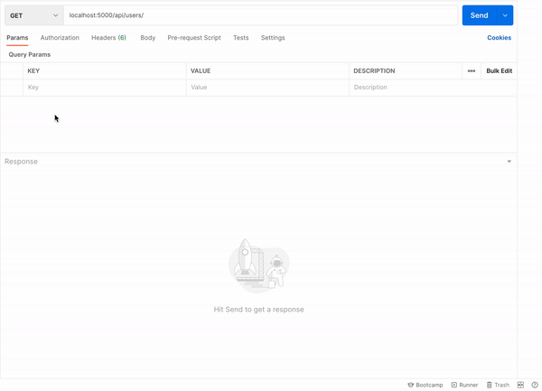
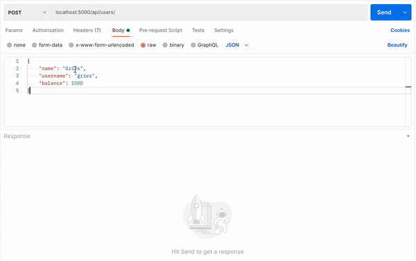
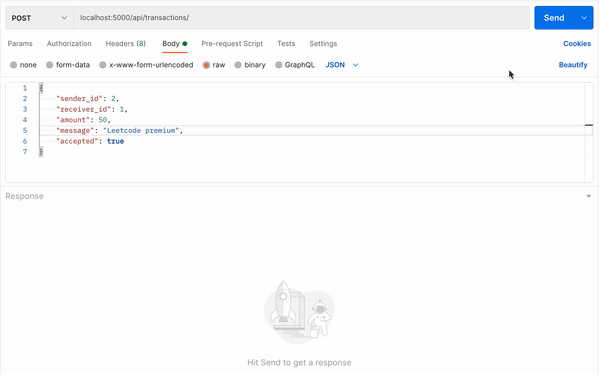

# Venmo-Routes

This is a simple Venmo-style payment backend model. The model comprises a database of all users on the platform, and allows for transactions such as transferring and requesting funds (to which receivers have the option to accept or decline).

## Built with
<ul>
  <li> Flask - For setting up routes and responding to network requests </li>
  <li> SQLite - For the database </li>
</ul>

## Demo Requests Using Postman

### Get all users
 </img>

### Create a user
 </img>

### Make a payment
 </img>

